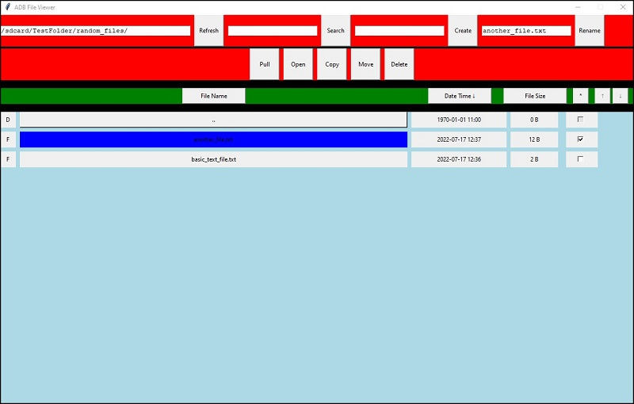

# About
This program came about due to the poor MTP support on Android devices (https://issuetracker.google.com/issues/36956498). File system changes made directly on the Android device are not reflected until the device is rebooted. Furthermore, there were performance issues that also made it difficult to deal with. Both of these issues combined made interacting with an Android device from a desktop impractical.

As an alternative, using ADB to interact with an Android device worked much better as the current state of the file system was visible and performance was much better. However, using a command line when interacting with a large amount of files across many folders can be a bit laborious, which is why a GUI representation has been made.

The following features are available:

* Explore an Android device's file system, either by typing in a path directly or by clicking on directories
* Navigate the display with scroll wheel or on-screen up and down buttons
* Sort files by various means
    * Name (A-Z or Z-A)
    * Date Modified (Newest to Oldest or Oldest to Newest)
    * Size (Smallest to Largest or Largest to Smallest)
* Filter by name
* Select multiple files
* Create Directories
* Pull files (single files, multiple files, or entire directory trees which are reconstructed on the host computer)
* Open files (automatically pulls the files to the host first. If it's a directory, then only the directory is opened, not the files within) 
* Copy or move files
* Delete files
* Rename files



# Pre-requisites
At a minimum, **adb.exe** must be present in the same folder as **adb_file_viewer.py**. On Windows, **AdbWinApi.dll** and **AdbWinUsbApi.dll** must also be present in the same folder. These files should be retrieved from official sources (Google) only. These are available from the development SDK.

# Instructions

Assuming the pre-requisites have been met, plug an Android device into the computer and then proceed as follows:

Launch the script with Python, for example:

```
python3 adb_file_viewer.py
```

The screen will be blank by default, with the path in the top-left prefilled as **/sdcard/**. If this is correct, click the refresh button to get a view of the Android device's storage. If this path is not correct, adjust it before clicking refresh.

Once the refresh is complete, it is then possible to interact with the file system.